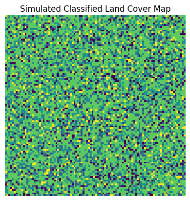
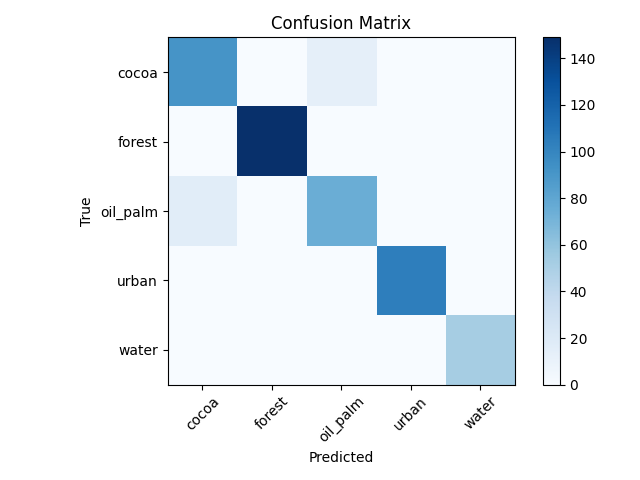
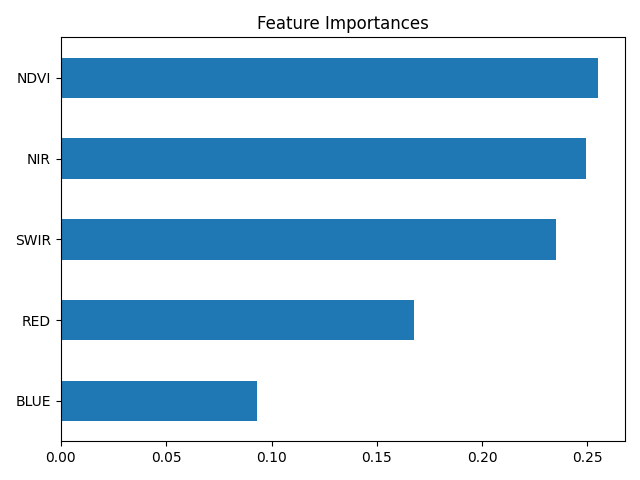

# 🛰️ AI-Based Land Cover Classification

This project simulates the classification of land cover types (e.g., forest, cocoa, urban, water) using synthetic satellite data and a machine learning model. It was created to demonstrate my skills in building geospatial ML pipelines, feature engineering, model evaluation, and visual interpretation.

---

## 🔍 Objective

Design a simplified but realistic simulation of a satellite-based AI classification pipeline that can:
- Generate multispectral data
- Classify land cover types using a Random Forest
- Produce visual evaluation and spatial prediction artefacts

---

## 🗂️ Project Structure

```
land-cover-classification-ai/
├── data/                  <- Synthetic dataset (CSV)
├── models/                <- Trained model & evaluation report
├── outputs/               <- Visuals (map, confusion matrix, feature importance)
├── src/                   <- Scripts to generate data and train model
├── tests/                 <- Basic unit test
├── README.md              <- You are here
├── requirements.txt       <- Dependencies
└── .gitignore
```

---

## 🧪 How it Works

1. **`generate_data.py`**  
   Simulates 2,000 rows of multispectral data (NDVI, NIR, RED, BLUE, SWIR) with associated land cover labels.

2. **`train_model.py`**  
   Trains a `RandomForestClassifier`, evaluates results, saves the model, and generates:

   - Confusion matrix
   - Feature importance chart
   - Simulated classified land cover map

---

## 📈 Results

### 🧭 Simulated Land Cover Map  


This grid visualizes the predictions over a 100×100 synthetic area. The values are random, so this map doesn't represent a real-world structure—but it simulates what a classified land surface might look like.

> ⚠️ Because the model is trained on **randomly simulated samples**, the map patterns may not be spatially meaningful.

---

### 🧮 Confusion Matrix  


This matrix shows how well the model distinguished between land cover types. We see:

- **Forest** is predicted quite well.
- **Cocoa and oil_palm** may have some overlap, which makes sense because their spectral signatures are very similar.
- Minor misclassifications between water/urban also occur.

> ⚠️ This imbalance could be due to randomness in simulation or insufficient separation in synthetic feature space.

---

### 🎯 Feature Importance  


According to the Random Forest model:

- **NDVI, NIR, and SWIR** are the most important features.
- **RED and BLUE** contribute less to class separation.

This aligns well with real remote sensing principles:
- NDVI and NIR are excellent for vegetation detection.
- SWIR helps separate urban/water/crop types.

---

## 🛠️ Tech Stack

- Python, Pandas, NumPy
- Scikit-learn
- Matplotlib
- Joblib

---

## 📦 Installation

```bash
git clone https://github.com/<your-user>/land-cover-classification-ai
cd land-cover-classification-ai
python -m venv .venv && source .venv/bin/activate
pip install -r requirements.txt

python src/generate_data.py
python src/train_model.py
```

---

## 🧪 Test

Run a basic test with:
```bash
pytest tests/
```

---

## 👋 Final Notes

This project was built to show my interest and skills in geospatial ML and sustainability analytics.  
While it uses **synthetic data**, it follows best practices in:
- structuring reproducible code
- interpreting model outputs
- building pipelines that could scale to real satellite data

---

© 2025 Dimitrios Diamantidis – MIT License
